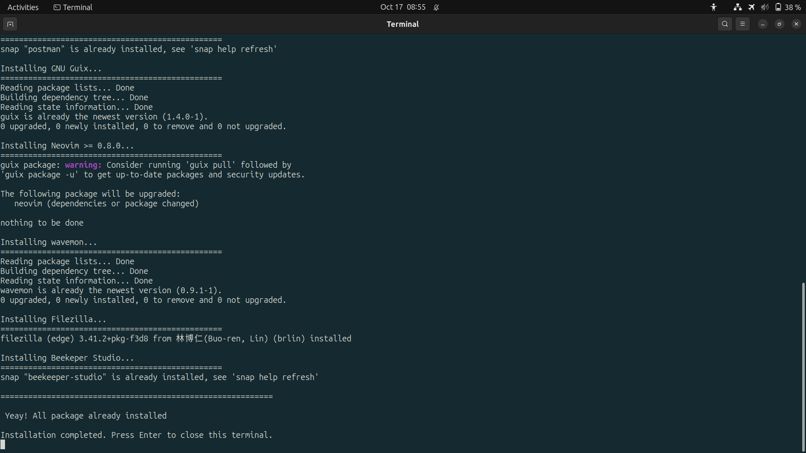

# Linux Setup with CLI


> Simplified ubuntu package installation setup for the first time. Especially for developers

#### **LIST OF PACKAGES**

_using this one simple command you'll get bunch of package which is usefull for you as developers especially for backend or frontend web developers._

| Package            | Description                      |
| ------------------ | -------------------------------- |
| NODE JS            | Node.js runtime environment      |
| NPM                | Node Package Manager             |
| PHP                | PHP programming language         |
| PYTHON             | Python programming language      |
| DOCKER             | Containerization platform        |
| VISUAL STUDIO CODE | Code editor by Microsoft         |
| BEEKEEPER STUDIO   | SQL editor and database manager  |
| FILEZILLA          | FTP client and server            |
| POSTMAN            | API development and testing tool |
| NEOVIM >= 0.8.0    | Vim-based text editor            |
| WAVEMON            | Wireless network monitoring tool |

Clone this repository

```
git clone https://github.com/faidfadjri/linux-setup.git
```

Move to the directory

```
cd linux-setup
```

Change file permission ( make it executable )

```
chmod +x ./install.sh
```

Execute the **install.sh** file

```
./install.sh
```

☕ Take a break and wait for a minutes ...
<br>

<br>
After you see this list of command. Finally you're package already installed.

[ Optional ] If you want add vim plugin for customize your VIM editor.

Copy file from git repository to your local machine

> .config/nvim/init.vim

Congrats! Happy Code 🥳
